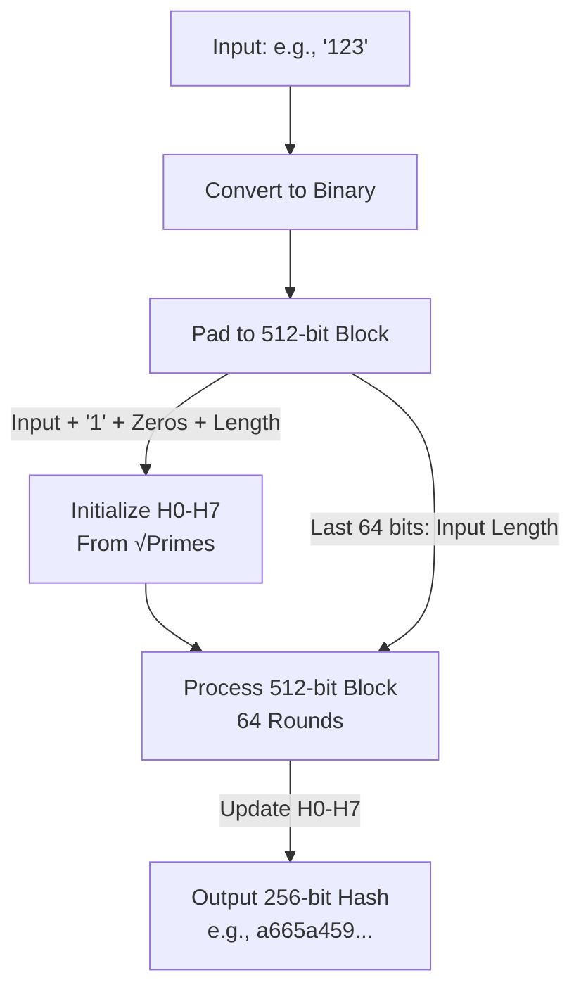

### Password hashing

#### 1. Convert Input to Binary

- **Input**: "123" (ASCII: 1=49, 2=50, 3=51).
- **Binary**: 00110001 00110010 00110011 (24 bits).

#### 2. Padding (Clarifying Your Confusion)

- SHA-256 processes data in **512-bit blocks**. Each block must be exactly 512 bits, with the **last 64 bits** reserved for the **input length** (in bits).
- **Steps**:
    - Add a 1 bit: 00110001 00110010 00110011 1 (25 bits).
    - Add zeros to reach **448 bits**: 448 - 25 = 423 zeros. Now: 00110001 00110010 00110011 1 000...000 (448 bits).
    - Append the input length (24 bits) as a 64-bit number: 000...00011000.
    - **Result**: A 512-bit block = 448 bits (input + 1 + zeros) + 64 bits (length).
- **Why 448 + 64?** The algorithm needs a fixed block size (512 bits). The last 64 bits store the length to handle inputs of any size, leaving up to 448 bits for the input and padding.

#### 3. Initialize Hash Values (Clarifying Your Confusion)

- SHA-256 starts with **eight 32-bit constants** (H0–H7), totaling 256 bits:
    - H0 = 6a09e667, H1 = bb67ae85, ..., H7 = 5be0cd19.
- **What are they?** Fixed starting values for the hash computation, same for every input.
- **Why "square roots of primes"?** They’re derived from the fractional parts of √2, √3, ..., √19 (first eight primes: 2, 3, 5, 7, 11, 13, 17, 19). For example:
    - √2 ≈ 1.414213562 → fractional part (0.414213562) × 2³² ≈ 6a09e667.
    - This ensures pseudo-random, secure starting values.
- **Purpose**: H0–H7 are a consistent, cryptographically strong baseline, updated during processing to produce the final hash.

#### 4. Process the Block

- The 512-bit block is split into 16 32-bit words, expanded to 64 words.
- **64 rounds** update H0–H7 using:
    - **Bitwise operations**: AND, OR, XOR, rotations (e.g., Ch(E,F,G) = (E AND F) XOR (NOT E AND G)).
    - **Constants**: 64 fixed values (from cube roots of primes).
    - **Modular addition**: Combine words, constants, and H0–H7 (mod 2³²).
- After 64 rounds, H0–H7 are updated.

#### 5. Output the Hash

- Concatenate the updated H0–H7 to get a 256-bit (64-hex-character) hash.
- For "123": a665a45920422f9d417e4867efdc4fb8a04a1f3fff1fa07e998e86f7f7a27ae3.