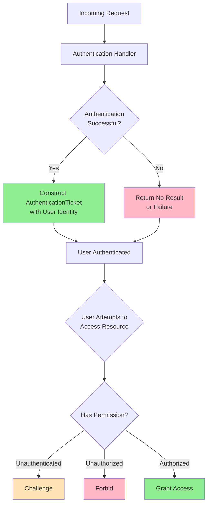

### Definition
Authentication: **process determine a user's identity**.

In ASP.NET Core, authentication is handled by `IAuthenticationService`. -> This is used by authentication **middleware**

	Note: Middleware is processed in the order it's added

**Schemes**: a term is used by Microsoft ASP.NET Core, indicate the registered authentication handlers and their configurations

Following example function is used
```csharp
builder.Services.AddAuthentication(JwtBearerDefaults.AuthenticationScheme);
```

`AddAuthentication` parameter [JwtBearerDefaults.AuthenticationScheme](https://learn.microsoft.com/en-us/dotnet/api/microsoft.aspnetcore.authentication.jwtbearer.jwtbearerdefaults.authenticationscheme#microsoft-aspnetcore-authentication-jwtbearer-jwtbearerdefaults-authenticationscheme) is the name of the scheme to use by default when a specific scheme isn't requested.

Multiple to add authentication scheme

### Authentication concepts

- Authentication is **responsible** to bring `ClaimsPrincipal`
- `ClaimsPrincipal` is used for authorization to make permission. ^6c7dc1
- Following is how to use authentication handler to generate the correct set of claims:
	- `Authentication Scheme`
	- Default Authentication scheme
	- `HttpContext.User`
	
> *If multiple schemes are registered and the default scheme isn't specified, a scheme must be specified in the authorize attribute, otherwise, the following error is thrown:*

`DefaultScheme`
- When there is only a single authentication scheme registered
- Eliminates the need to specify the `DefaultScheme` in [`AddAuthentication(IServiceCollection)`](https://learn.microsoft.com/en-us/dotnet/api/microsoft.extensions.dependencyinjection.authenticationservicecollectionextensions.addauthentication#microsoft-extensions-dependencyinjection-authenticationservicecollectionextensions-addauthentication\(microsoft-extensions-dependencyinjection-iservicecollection\)) or [`AddAuthenticationCore(IServiceCollection)`](https://learn.microsoft.com/en-us/dotnet/api/microsoft.extensions.dependencyinjection.authenticationcoreservicecollectionextensions.addauthenticationcore#microsoft-extensions-dependencyinjection-authenticationcoreservicecollectionextensions-addauthenticationcore\(microsoft-extensions-dependencyinjection-iservicecollection\)).

### Authentication scheme

The authentication scheme can select which authentication handler is responsible for generating the correct set of [[#^6c7dc1|claims]].

An authentication scheme is a name that corresponds to:
- An authentication handler
- Options for configuring that specific instance of the handler

When configuring authentication, it's common to specify the default authentication scheme. The default scheme is used unless a resource requests a specific scheme. It's also possible to:

- Specify different default schemes to use for [[0001 Authentication#Authenticate|authenticate]], [[#Challenge|challange]], and [[0001 Authentication#Forbid|forbid]] actions.
- Combine multiple schemes into one using [[0600 Policy Schemes|Policy Schemes]] 

### Authentication handler
#### An authentication handler:
- Is a type that implements the behavior of a scheme
- Is derived from `IAuthenticationHandler` or `AuthenticationHandler<TOptions>`
- Has the primary responsibility to authenticate users.

#### Flow of authentication handler.

Incoming request -> Authentication Handler construct `AuthenticationTicket` objects representing user identity (if authentication is successful) -> return `no result` or `failure` if authentication unsuccessful.

Authentication handler have methods for challange and forbid actions when user attempt to access resources:
+ [[#Forbid]]: they're unauthorized to access
+ [[#Challenge]]: When they're unauthenticated



#### ``Remote`AuthenticationHandler<TOptions>` vs `AuthenticationHandler<TOptions>`

`RemoteAuthenticationHandler<TOptions>`: is the class for authentication that require remote authentication step.

When the remote authentication step is finished, the handler calls back to the `CallbackPath` set by the handler. 

The handler finishes the authentication step using the information passed to the `HandleRemoteAuthenticateAsync` callback

Resource
[[0200 OpenID Connect]]
[OAuth 2.0](https://oauth.net/2/) and [OIDC](https://openid.net/developers/how-connect-works/) both use this pattern

#### Authenticate
Is an **action** of authentication scheme. It returns an [`AuthenticateResult`](https://learn.microsoft.com/en-us/dotnet/api/microsoft.aspnetcore.authentication.authenticateresult)indicating whether authentication was successful and, if so, the user's identity in an authentication ticket.

#### Challenge
An authentication challenge is invoked by Authorization when an unauthenticated user requests an endpoint that requires authentication. 

Authorization invokes a challenge using the specified authentication scheme(s), or the default if none is specified. See [`ChallengeAsync`](https://learn.microsoft.com/en-us/dotnet/api/microsoft.aspnetcore.authentication.authenticationhttpcontextextensions.challengeasync). 
#### Forbid
An authentication scheme's forbid action is called by Authorization when an authenticated user attempts to access a resource they're not permitted to access. See [`ForbidAsync`](https://learn.microsoft.com/en-us/dotnet/api/microsoft.aspnetcore.authentication.authenticationhttpcontextextensions.forbidasync)

