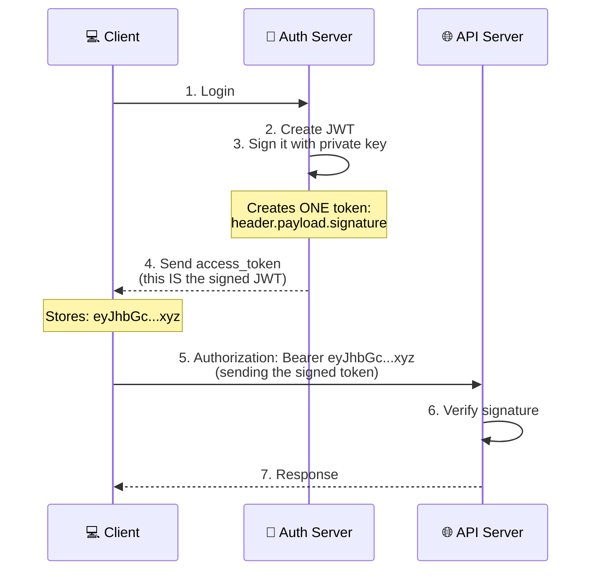

[[0300 JWT Authentication]]
Insecure handling of access tokens, such as weak authentication or storing tokens in vulnerable client-side storage, can lead to significant security vulnerabilities. For example, storing access tokens directly in the browser using local storage, session storage, or web workers. The following section contains best practices for apps using and creating access tokens.

### Use standards
Standards like OpenID Connect or OAuth should **always** be used when creating access tokens. 

**Access tokens** should **not** be created in production apps without adhering to the security precautions outlined in this article. Creating access tokens should be limited to test scenarios.

### Use asymmetric keys
Asymmetric keys should **always** be used when creating access tokens. The public key is available in the well known endpoints and the API clients can validate the signature of the access token using the public key.

#### Asymmetric keys explain
**Asymmetric encryption** uses a **key pair**:

- **Private Key** (kept secret by auth server) → Signs tokens
- **Public Key** (shared publicly) → Verifies tokens



### Never create an access token from a username/password request
You should **NOT** create an access token from a username/password request. Username/password requests aren't authenticated and are vulnerable to impersonation and phishing attacks. Instead using [[#Use standards|standards way]] to generate access token

### Use cookies
For secure web apps, a backend is required to store access tokens on a trusted server. Only a secure **HTTP only cookie** is shared on the client browser
#### Explain Cookie in this JWT 
> Note: This suggestion is try to suggest using HttpOnly to store the JWT, it different entirely with using HttpContext.SignIn(CookieScheme) even both use Cookie 

**The cookie itself always lives in the client's browser**, but there's a crucial difference in how it's managed:
##### 1. **HttpOnly Cookie (Recommended - what the document suggests)**

- Cookie is **stored in the browser** (client side)
- Cookie is **set and managed by the server**
- JavaScript **cannot access** it (because of HttpOnly flag)
- Browser **automatically** sends it with requests to the server
- The actual access token/sensitive data stays **on the server**
- Only a session ID or encrypted token is in the cookie
##### Code example
```csharp
// Store JWT in HttpOnly cookie 
Response.Cookies.Append("jwt", token, new CookieOptions { HttpOnly = true, Secure = true });
```
##### 2. **Client-Side Cookie/Storage (Not Recommended)**
- Data stored in browser via JavaScript
- JavaScript **can access** it (using `document.cookie` or localStorage)
- Vulnerable to XSS attacks
- You manage sending it with requests manually

Key Different

| Aspect             | HttpOnly Cookie (Server-managed) | Client-Side Storage            |
| ------------------ | -------------------------------- | ------------------------------ |
| **Set by**         | Server                           | (Set-Cookie header) JavaScript |
| **JS Access**      | ❌ No (secure)                    | ✅ Yes (vulnerable)             |
| **XSS Protection** | ✅ Protected                      | ❌ Vulnerable**                 |
| **Auto-sent**      | ✅Yes                             | ❌ Manual                       |
##### HttpOnly vs HttpContext
![[Pasted image 20251026105033.png]]
### Handling access tokens

When using access tokens in a client application, the access tokens must be rotated, persisted, and stored on the server. In a web app, cookies are used to secure the session and can be used to store tokens via the [SaveTokens](https://learn.microsoft.com/en-us/dotnet/api/microsoft.aspnetcore.authentication.remoteauthenticationoptions.savetokens) property.

[SaveTokens](https://learn.microsoft.com/en-us/dotnet/api/microsoft.aspnetcore.authentication.remoteauthenticationoptions.savetokens) doesn't refresh access tokens automatically, but this functionality is planned for a future release. In the meantime, you can manually refresh the access token as [demonstrated in the Blazor Web App with OIDC documentation](https://learn.microsoft.com/en-us/aspnet/core/blazor/security/blazor-web-app-with-oidc?pivots=with-bff-pattern#token-refresh) or use a third-party NuGet package, such as [`Duende.AccessTokenManagement.OpenIdConnect`](https://www.nuget.org/packages/Duende.AccessTokenManagement.OpenIdConnect). For more information, see [Duende token management](https://docs.duendesoftware.com/identityserver/v7/quickstarts/3a_token_management/).

> Note
> If deploying to production, the cache should work in a multi-instance deployment. A persistent cache is normally required.

Some secure token servers encrypt the access tokens. Access tokens do not require any format. When using OAuth introspection, a reference token is used instead of an access token. A client (UI) application should never open an access token as the access token is not intended for this. Only an API for which the access token was created for should open the access token.

- Do not open access tokens in a UI application
- Do not send the ID token to the APIs
- Access tokens can have any format
- Access tokens can be encrypted
- Access tokens expire and need to be rotated
- Access tokens are persisted on a secure backend server